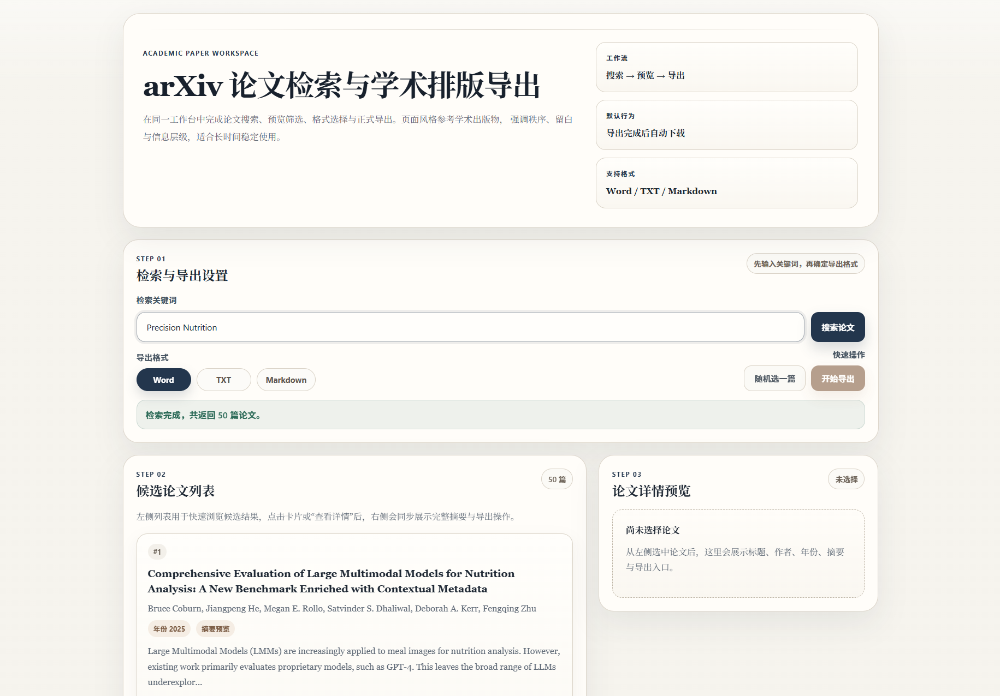

# arXiv Flask App

Please choose a language / 请选择语言：

- [中文说明](README.zh-CN.md)
- [English Guide](README.en.md)

A Flask-based academic paper workspace for searching arXiv papers, previewing candidates, parsing PDFs, and exporting Word / TXT / Markdown documents.

一个基于 Flask 的学术论文工作台，用于检索 arXiv 论文、预览候选结果、解析 PDF，并导出 Word / TXT / Markdown 文档。

