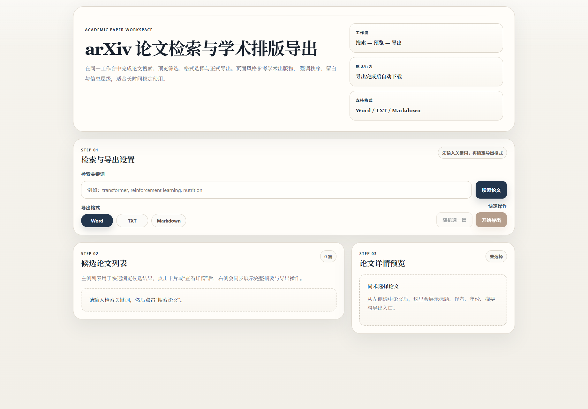
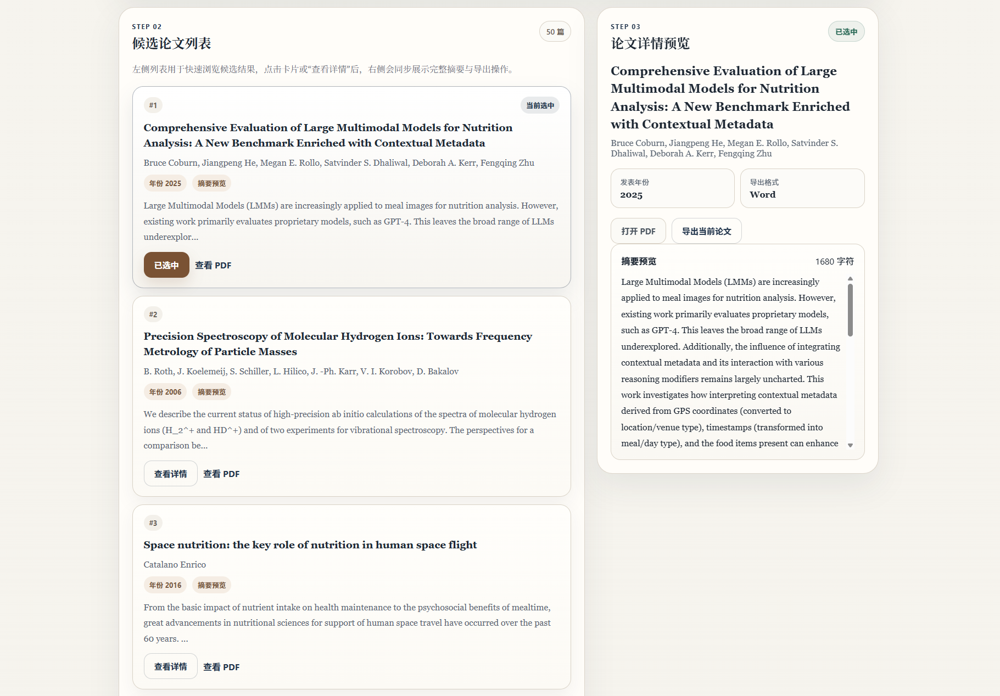
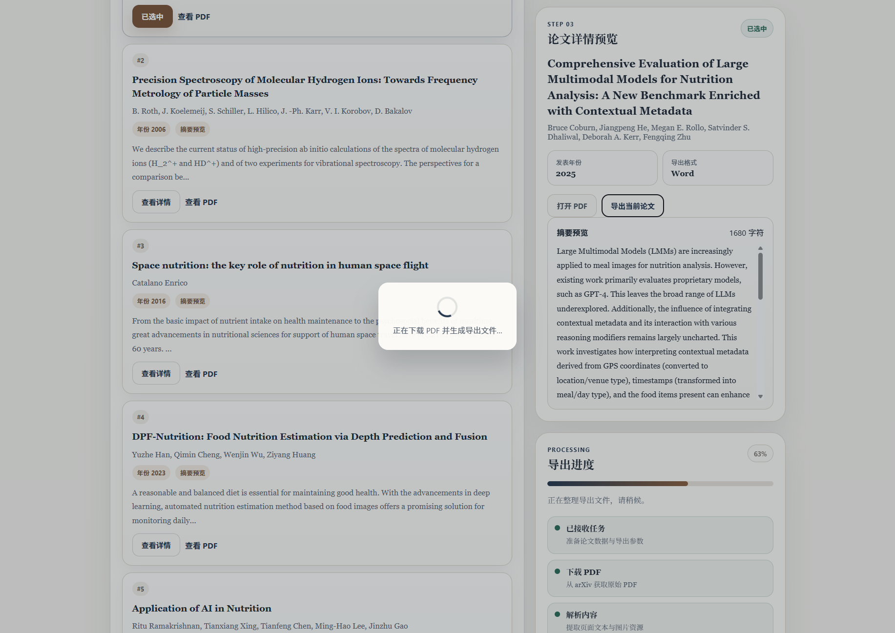
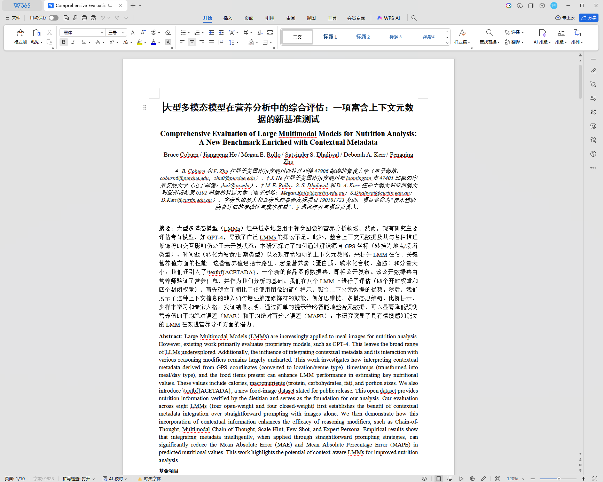

# arXiv Flask App

[English](README.en.md) | 中文

一个面向学术论文工作流的 Flask Web 应用，用于检索 arXiv 论文、预览候选结果、解析 PDF 内容，并导出 Word / TXT / Markdown 文件。界面以“搜索 -> 预览 -> 导出”为主流程，适合论文整理、文献初筛和本地化排版实验。

## 项目思路

本项目希望把论文检索、结果筛选、PDF 获取、内容解析和文档导出合并到同一个轻量级工作台中。用户输入关键词后，后端通过 arXiv API 获取候选论文；前端展示论文标题、作者、年份、摘要和 PDF 入口；用户选择论文后，系统下载 PDF，使用 PyMuPDF 提取文本、图片和结构信息，再通过 python-docx 等工具生成可继续编辑的文档。

项目保留了本地 LLM 翻译扩展点：当导出 Word 时，可以通过 Ollama 兼容接口对论文内容进行中文化处理。默认接口地址和模型可通过环境变量配置，因此既可以单机运行，也可以接入已有的本地模型服务。

## 主要功能

- arXiv 关键词检索，默认返回最多 50 篇候选论文。
- 候选论文列表展示，包括标题、作者、年份和摘要预览。
- 论文详情预览，支持打开原始 PDF。
- 支持导出 Word、TXT、Markdown。
- Word 导出包含论文标题、作者、摘要、正文、图片等结构化内容。
- 支持通过 Ollama 兼容 API 进行本地翻译。
- 导出完成后自动提供下载入口。

## 项目截图

### 1. 首页与检索入口



### 2. 关键词检索结果


### 3. 候选论文与详情预览



### 4. 导出进度



### 5. Word 导出结果



## 使用方法

1. 克隆仓库。

```powershell
git clone https://github.com/xinruliuresearch-maker/arxiv_flask_app.git
cd arxiv_flask_app
```

2. 创建并激活虚拟环境。

```powershell
python -m venv .venv
.\.venv\Scripts\Activate.ps1
```

macOS / Linux 可使用：

```bash
python3 -m venv .venv
source .venv/bin/activate
```

3. 安装依赖。

```powershell
pip install -r requirements.txt
```

4. 启动应用。

```powershell
python run_app.py
```

5. 在浏览器打开：

```text
http://127.0.0.1:5000
```

6. 输入关键词，选择导出格式，点击“搜索论文”。选择候选论文后，可查看详情、打开 PDF 或导出当前论文。

## 可选配置

如果需要使用本地翻译功能，请先启动 Ollama 或其他兼容 `/api/generate` 的服务，然后按需配置环境变量。

```powershell
$env:OLLAMA_API_URL="http://127.0.0.1:11434/api/generate"
$env:OLLAMA_MODEL="deepseek-r1:8b"
python run_app.py
```

默认值：

- `OLLAMA_API_URL`: `http://127.0.0.1:11434/api/generate`
- `OLLAMA_MODEL`: `deepseek-r1:8b`

## 部署方法

### 本地部署

适合个人使用、论文整理和功能测试。

```powershell
python -m venv .venv
.\.venv\Scripts\Activate.ps1
pip install -r requirements.txt
python run_app.py
```

### 服务器部署

生产环境建议使用 Gunicorn 或 Waitress 等 WSGI 服务器，不建议直接使用 Flask debug server。

Linux 示例：

```bash
python3 -m venv .venv
source .venv/bin/activate
pip install -r requirements.txt
pip install gunicorn
gunicorn -w 2 -b 0.0.0.0:5000 app:app
```

Windows 示例：

```powershell
python -m venv .venv
.\.venv\Scripts\Activate.ps1
pip install -r requirements.txt
pip install waitress
waitress-serve --host=0.0.0.0 --port=5000 app:app
```

如需公网访问，建议在前面增加 Nginx / Caddy 等反向代理，并配置 HTTPS、上传/下载大小限制和访问控制。

## 文件架构

```text
arxiv_flask_app/
├── app.py                    # Flask 主应用：路由、arXiv 检索、PDF 解析、导出逻辑
├── run_app.py                # 本地启动入口
├── requirements.txt          # Python 依赖
├── README.md                 # 语言选择入口
├── README.zh-CN.md           # 中文说明文档
├── README.en.md              # English documentation
├── static/
│   └── style.css             # 前端样式
├── templates/
│   └── index.html            # 单页工作台界面
└── docs/
    └── screenshots/          # README 展示截图
```

## 技术栈

- Flask: Web 服务与路由
- requests / feedparser: arXiv API 请求与 Atom feed 解析
- PyMuPDF: PDF 文本、图片与页面结构提取
- python-docx: Word 文档生成
- HTML / CSS / JavaScript: 前端交互界面
- Ollama-compatible API: 可选本地翻译能力
